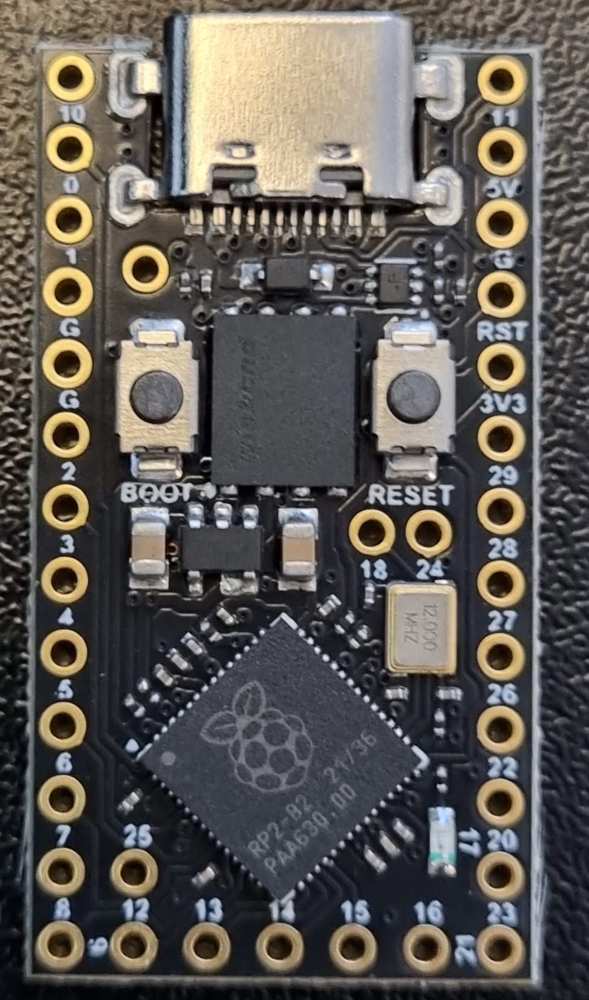
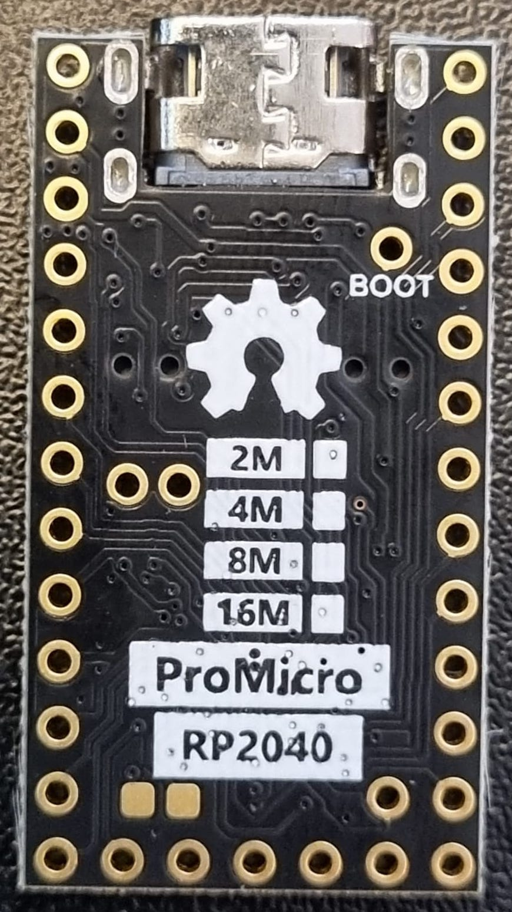
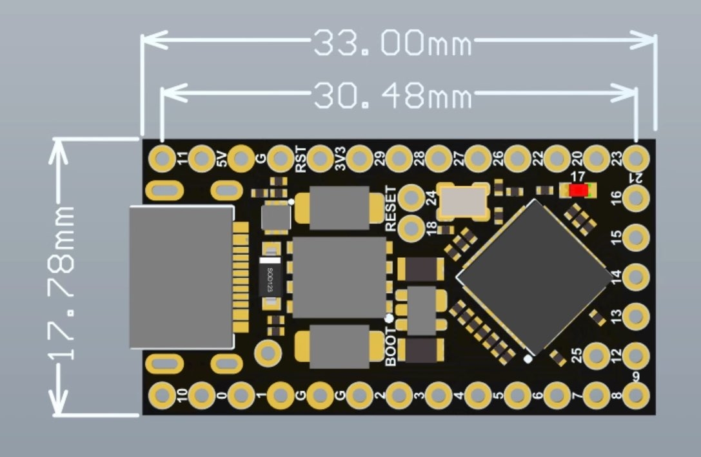
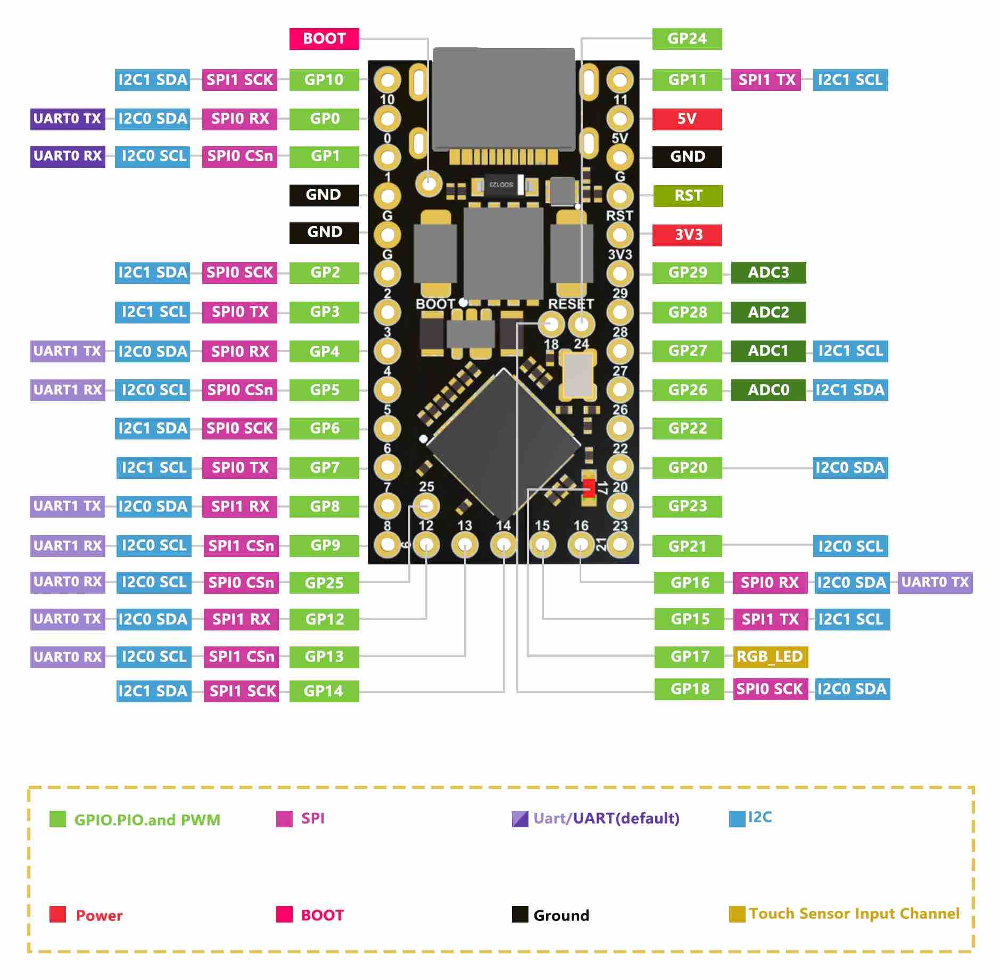
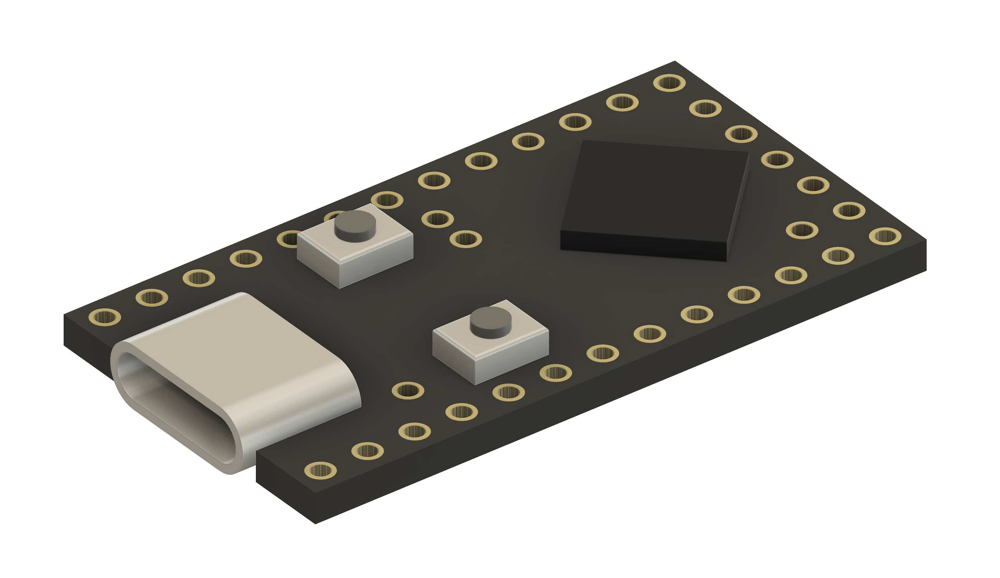

# KiCad Symbol and Footprint for the Pro Micro RP2040

> [!WARNING]
> The information and material (code, designs, files, ...) are provided "AS IS". We make no representation or warranty of any kind, express or implied, regarding the accuracy, adequacy, validity, reliability, availability, or completeness of any information or material. Use this at your own risk.

RP2040ProMicro

https://www.aliexpress.com/item/1005006130019224.html

https://www.aliexpress.com/item/1005005881019149.html ("Pro Micro 16M" option)

## Official Documentation

Link received from the AliExpress vendor:

[https://www.nologo.tech/product/raspberrypie/RP2040ProMicro.html?spm=a2g0s.imconversation.0.0.11b13e5fFdANGe](https://www.nologo.tech/product/raspberrypie/RP2040ProMicro.html?spm=a2g0s.imconversation.0.0.11b13e5fFdANGe)

I measured mine with digital calipers and I can confirm that the manufactured units are within 0.1mm of the documented dimensions. 

The two pads on the back, in the bottom left, are not documented. However, there is a similar model from the same manufacturer, the "Pico Mini RP2040". The Pico Mini has similar pads in the same location. There, the left and right pad are documented as `SWDIO` and `SWCLK` respectively ("left" and "right", when looking at the back). 

## 3D Models

The `3d_models` folder contains a quick and dirty 3D model in different formats (3mf, obj, step and stl).

It is very basic, lacks many details, and might not be 100% accurate. I did model the most protruding features, so it can be used for visual sizing and collision checks in projects that use this part.

