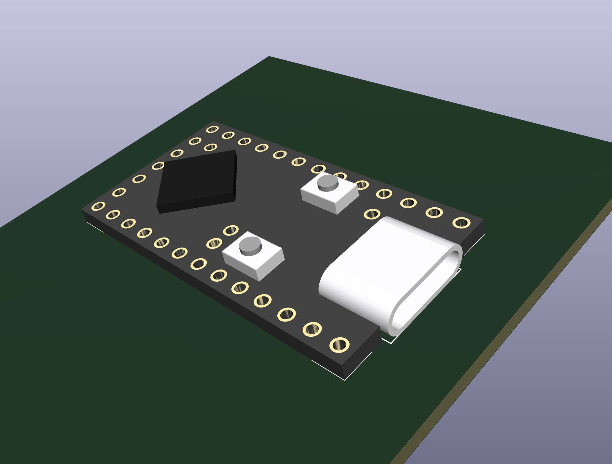

# KiCad Symbol and Footprint for the Pro Micro RP2040

> [!WARNING]
> The information and material (code, designs, files, ...) are provided "AS IS". We make no representation or warranty of any kind, express or implied, regarding the accuracy, adequacy, validity, reliability, availability, or completeness of any information or material. Use this at your own risk.

This repository provides KiCad files and a basic 3D model for the "Pro Micro RP2040". This is a RP2040-based board, which is pin-compatible with the Arduino Pro Micro. This makes it a drop-in replacement for projects that need more processing power or more flash memory. It is popular in the custom keyboard community, where the Arduino Pro Micro (and pin-compatible alternatives) are the golden standard.  

 

At the time of writing, these are some places where they can be purchased:

* [https://www.aliexpress.com/item/1005006130019224.html](https://www.aliexpress.com/item/1005006130019224.html)
* [https://www.aliexpress.com/item/1005005881019149.html](https://www.aliexpress.com/item/1005005881019149.html) ("Pro Micro 16M" option)
* [https://item.taobao.com/item.htm?spm=a1z10.3-c.w4002-24438210134.14.2bb76ea3fuQpnw&id=729462849658](https://item.taobao.com/item.htm?spm=a1z10.3-c.w4002-24438210134.14.2bb76ea3fuQpnw&id=729462849658)

## Official Documentation

Link received from the AliExpress vendor:

[https://www.nologo.tech/product/raspberrypie/RP2040ProMicro.html?spm=a2g0s.imconversation.0.0.11b13e5fFdANGe](https://www.nologo.tech/product/raspberrypie/RP2040ProMicro.html?spm=a2g0s.imconversation.0.0.11b13e5fFdANGe)

I measured mine with digital calipers and I can confirm that the manufactured units are within 0.1mm of the documented dimensions. 

The two pads on the back, in the bottom left, are not documented. However, there is a similar model from the same manufacturer, the "Pico Mini RP2040". The Pico Mini has similar pads in the same location. There, the left and right pad are documented as `SWDIO` and `SWCLK` respectively ("left" and "right", when looking at the back). 

## Symbol

To use the symbol, simply add `pro_micro_rp2040.kicad_sym` to your global or local symbol library.

## Footprint

To use the footprint, simply add `pro_micro_rp2040.pretty` to your global or local footprint library.

Associate the 3D model to the footprint if a preview in the 3D PCB view is desired (see next section).

## 3D Models

The `3d_models` folder contains a quick and dirty 3D model in different formats (3mf, obj, step and stl).

It is very basic and lacks many details. I did model the most protruding features, so it can be used for visual sizing and collision checks in projects that use this part.

For KiCad, simply add the step file in your project's footprint settings if a preview is desired.

